## Cleaning Required
- Remove duplicates
- Incorrect data entry in credit score
- Change 'Monthly Debt' from currency format to float
- Remove '#VALUE!' from 'Maximum Open Credit'
- Fix spelling difference in 'Purpose' and 'Home Ownership'
- Drop 'Current Loan Amount' where value equals 99999999
- Null values
- Categorical variables
***


```python
import pandas as pd
import numpy as np
import re

from statistics import mean 
from scipy.stats.mstats import mode

import seaborn as sns
from matplotlib import pyplot as plt

from sklearn import preprocessing
from sklearn.preprocessing import LabelEncoder
```


```python
train = pd.read_csv('train.csv',low_memory=False)
```


```python
definitions = {'Loan ID': 'A unique Identifier for the loan information.',
               'Customer ID': 'A unique identifier for the customer. Customers may have more than one loan.',
               'Loan Status': 'A categorical variable indicating if the loan was paid back or defaulted.',
               'Current Loan Amount': 'This is the loan amount that was either completely paid off, or the amount that was defaulted.',
               'Term': 'A categorical variable indicating if it is a short term or long term loan.',
               'Credit Score': 'A value between 0 and 800 indicating the riskiness of the borrowers credit history.',
               'Years in current job': 'A categorical variable indicating how many years the customer has been in their current job.',
               'Home Ownership': 'Categorical variable indicating home ownership. Values are "Rent", "Home Mortgage", and "Own". If the value is OWN, then the customer is a home owner with no mortgage',
               'Annual Income': "The customer's annual income",
               'Purpose': 'A description of the purpose of the loan.',
               'Monthly Debt': "The customer's monthly payment for their existing loans",
               'Years of Credit History': "The years since the first entry in the customer’s credit history",
               'Months since last delinquent': 'Months since the last loan delinquent payment',
               'Number of Open Accounts': 'The total number of open credit cards',
               'Number of Credit Problems': 'The number of credit problems in the customer records.',
               'Current Credit Balance': 'The current total debt for the customer',
               'Maximum Open Credit': 'The maximum credit limit for all credit sources.',
               'Bankruptcies': 'The total number of bankruptcies.',
               'Tax Liens': 'The number of tax liens.'}
```


```python
def define(column_name):
    """Returns definition of column name if name is in definitions"""
    try:
        print(definitions[column_name])
    except KeyError:
        print("'" + column_name + "'",'not found in definitions.')
```


```python
train.info()
```

    <class 'pandas.core.frame.DataFrame'>
    RangeIndex: 256984 entries, 0 to 256983
    Data columns (total 19 columns):
    Loan ID                         256984 non-null object
    Customer ID                     256984 non-null object
    Loan Status                     256984 non-null object
    Current Loan Amount             256984 non-null int64
    Term                            256984 non-null object
    Credit Score                    195308 non-null float64
    Years in current job            245508 non-null object
    Home Ownership                  256984 non-null object
    Annual Income                   195308 non-null float64
    Purpose                         256984 non-null object
    Monthly Debt                    256984 non-null object
    Years of Credit History         256984 non-null float64
    Months since last delinquent    116601 non-null float64
    Number of Open Accounts         256984 non-null int64
    Number of Credit Problems       256984 non-null int64
    Current Credit Balance          256984 non-null int64
    Maximum Open Credit             256984 non-null object
    Bankruptcies                    256455 non-null float64
    Tax Liens                       256961 non-null float64
    dtypes: float64(6), int64(4), object(9)
    memory usage: 37.3+ MB


Verifiying which ID can have duplicates.


```python
define('Loan ID') #should have no duplicates
```

    A unique Identifier for the loan information.


```python
define('Customer ID') #can have duplicates
```

    A unique identifier for the customer. Customers may have more than one loan.


```python
train.duplicated('Loan ID').value_counts()
```


    False    215700
    True      41284
    dtype: int64


Preparing to specifically drop the duplicate row with null values so the correct row stays.


```python
duplics = train[train.duplicated('Loan ID',False)].isnull().any(axis=1)
```


```python
train.drop(duplics[duplics == True].index,inplace = True)
```


```python
train.duplicated('Loan ID').value_counts()
```


    False    192570
    True      10405
    dtype: int64


```python
train.drop_duplicates('Loan ID',inplace=True)
```


```python
train.duplicated('Loan ID').value_counts()
```


    False    192570
    dtype: int64


```python
missing_values0 = train.isnull().sum()
missing_values0 = missing_values0[missing_values0 > 0].sort_values(ascending=True)
missing_values0
```


    Tax Liens                          21
    Bankruptcies                      379
    Years in current job             6668
    Credit Score                    42287
    Annual Income                   42287
    Months since last delinquent    97245
    dtype: int64


```python
print(train['Loan Status'].value_counts() / train['Loan Status'].count(),end='\n\n')
print(train['Loan Status'].value_counts(),end='\n\n')
print('Number of records:', len(train))
```

    Fully Paid     0.914945
    Charged Off    0.085055
    Name: Loan Status, dtype: float64
    
    Fully Paid     176191
    Charged Off     16379
    Name: Loan Status, dtype: int64
    
    Number of records: 192570


```python
train[pd.isnull(train['Annual Income'])]['Loan Status'].value_counts()
```


    Fully Paid     42209
    Charged Off       78
    Name: Loan Status, dtype: int64


```python
train.dropna(axis=0,subset=['Annual Income'],inplace=True)
```


```python
round(42287/192570*100,2)
```


    21.96


```python
missing_values1 = train.isnull().sum()
missing_values1[missing_values0.index.values]
```


    Tax Liens                          14
    Bankruptcies                      293
    Years in current job             5134
    Credit Score                        0
    Annual Income                       0
    Months since last delinquent    73984
    dtype: int64


```python
#train.dropna(axis=0,subset=['Months since last delinquent'],inplace=True)
```


```python
train['Current Loan Amount'].describe()
```


    count    1.502830e+05
    mean     2.343967e+07
    std      4.234981e+07
    min      5.050000e+02
    25%      9.028000e+03
    50%      1.532900e+04
    75%      3.481550e+04
    max      1.000000e+08
    Name: Current Loan Amount, dtype: float64


```python
train = train[train['Current Loan Amount']!=99999999]
```


```python
train['Current Loan Amount'].describe()
```


    count    115073.000000
    mean      13769.544593
    std        8210.703609
    min         505.000000
    25%        7562.000000
    50%       11945.000000
    75%       18926.000000
    max       39304.000000
    Name: Current Loan Amount, dtype: float64


```python
missing_values2 = train.isnull().sum()
missing_values2[missing_values0.index.values]
```


    Tax Liens                          12
    Bankruptcies                      222
    Years in current job             3759
    Credit Score                        0
    Annual Income                       0
    Months since last delinquent    54479
    dtype: int64


```python
train[pd.isnull(train['Months since last delinquent'])]['Loan Status'].value_counts()
```


    Fully Paid     54355
    Charged Off      124
    Name: Loan Status, dtype: int64


```python
sns.distplot(train['Months since last delinquent'].dropna())
```


    <matplotlib.axes._subplots.AxesSubplot at 0x1a11b77b38>


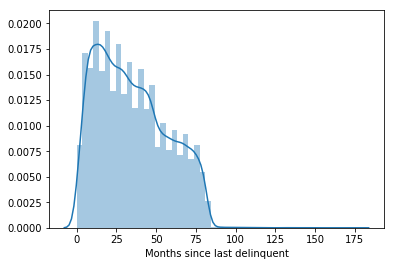


```python
train[pd.isnull(train['Years in current job'])]['Loan Status'].value_counts()
```


    Fully Paid     3740
    Charged Off      19
    Name: Loan Status, dtype: int64


```python
train[pd.isnull(train['Bankruptcies'])]['Loan Status'].value_counts()
```


    Fully Paid    222
    Name: Loan Status, dtype: int64


```python
train.head()
```


<div>
<style>
    .dataframe tbody tr th:only-of-type {
        vertical-align: middle;
    }

    .dataframe tbody tr th {
        vertical-align: top;
    }

    .dataframe thead th {
        text-align: right;
    }
</style>
<table border="1" class="dataframe">
  <thead>
    <tr style="text-align: right;">
      <th></th>
      <th>Loan ID</th>
      <th>Customer ID</th>
      <th>Loan Status</th>
      <th>Current Loan Amount</th>
      <th>Term</th>
      <th>Credit Score</th>
      <th>Years in current job</th>
      <th>Home Ownership</th>
      <th>Annual Income</th>
      <th>Purpose</th>
      <th>Monthly Debt</th>
      <th>Years of Credit History</th>
      <th>Months since last delinquent</th>
      <th>Number of Open Accounts</th>
      <th>Number of Credit Problems</th>
      <th>Current Credit Balance</th>
      <th>Maximum Open Credit</th>
      <th>Bankruptcies</th>
      <th>Tax Liens</th>
    </tr>
  </thead>
  <tbody>
    <tr>
      <th>0</th>
      <td>000025bb-5694-4cff-b17d-192b1a98ba44</td>
      <td>5ebc8bb1-5eb9-4404-b11b-a6eebc401a19</td>
      <td>Fully Paid</td>
      <td>11520</td>
      <td>Short Term</td>
      <td>741.0</td>
      <td>10+ years</td>
      <td>Home Mortgage</td>
      <td>33694.0</td>
      <td>Debt Consolidation</td>
      <td>$584.03</td>
      <td>12.3</td>
      <td>41.0</td>
      <td>10</td>
      <td>0</td>
      <td>6760</td>
      <td>16056</td>
      <td>0.0</td>
      <td>0.0</td>
    </tr>
    <tr>
      <th>1</th>
      <td>00002c49-3a29-4bd4-8f67-c8f8fbc1048c</td>
      <td>927b388d-2e01-423f-a8dc-f7e42d668f46</td>
      <td>Fully Paid</td>
      <td>3441</td>
      <td>Short Term</td>
      <td>734.0</td>
      <td>4 years</td>
      <td>Home Mortgage</td>
      <td>42269.0</td>
      <td>other</td>
      <td>$1,106.04</td>
      <td>26.3</td>
      <td>NaN</td>
      <td>17</td>
      <td>0</td>
      <td>6262</td>
      <td>19149</td>
      <td>0.0</td>
      <td>0.0</td>
    </tr>
    <tr>
      <th>2</th>
      <td>00002d89-27f3-409b-aa76-90834f359a65</td>
      <td>defce609-c631-447d-aad6-1270615e89c4</td>
      <td>Fully Paid</td>
      <td>21029</td>
      <td>Short Term</td>
      <td>747.0</td>
      <td>10+ years</td>
      <td>Home Mortgage</td>
      <td>90126.0</td>
      <td>Debt Consolidation</td>
      <td>$1,321.85</td>
      <td>28.8</td>
      <td>NaN</td>
      <td>5</td>
      <td>0</td>
      <td>20967</td>
      <td>28335</td>
      <td>0.0</td>
      <td>0.0</td>
    </tr>
    <tr>
      <th>3</th>
      <td>00005222-b4d8-45a4-ad8c-186057e24233</td>
      <td>070bcecb-aae7-4485-a26a-e0403e7bb6c5</td>
      <td>Fully Paid</td>
      <td>18743</td>
      <td>Short Term</td>
      <td>747.0</td>
      <td>10+ years</td>
      <td>Own Home</td>
      <td>38072.0</td>
      <td>Debt Consolidation</td>
      <td>$751.92</td>
      <td>26.2</td>
      <td>NaN</td>
      <td>9</td>
      <td>0</td>
      <td>22529</td>
      <td>43915</td>
      <td>0.0</td>
      <td>0.0</td>
    </tr>
    <tr>
      <th>4</th>
      <td>0000757f-a121-41ed-b17b-162e76647c1f</td>
      <td>dde79588-12f0-4811-bab0-e2b07f633fcd</td>
      <td>Fully Paid</td>
      <td>11731</td>
      <td>Short Term</td>
      <td>746.0</td>
      <td>4 years</td>
      <td>Rent</td>
      <td>50025.0</td>
      <td>Debt Consolidation</td>
      <td>$355.18</td>
      <td>11.5</td>
      <td>NaN</td>
      <td>12</td>
      <td>0</td>
      <td>17391</td>
      <td>37081</td>
      <td>0.0</td>
      <td>0.0</td>
    </tr>
  </tbody>
</table>
</div>


```python
print(train['Loan Status'].value_counts() / train['Loan Status'].count(),end='\n\n')
print(train['Loan Status'].value_counts(),end='\n\n')
print('Number of records:', len(train))
```

    Fully Paid     0.858342
    Charged Off    0.141658
    Name: Loan Status, dtype: float64
    
    Fully Paid     98772
    Charged Off    16301
    Name: Loan Status, dtype: int64
    
    Number of records: 115073


```python
sns.catplot(data=train, x='Loan Status', kind='count')
```


    <seaborn.axisgrid.FacetGrid at 0x1a11b2d390>


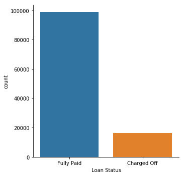


```python
le = LabelEncoder()
train['Loan Status'] = le.fit_transform(train['Loan Status'])
```


```python
train['Loan Status'].value_counts().index.values
```


    array([1, 0])


```python
le.inverse_transform(train['Loan Status'].value_counts().index.values)
```


    array(['Fully Paid', 'Charged Off'], dtype=object)


```python
train.head()
```


<div>
<style scoped>
    .dataframe tbody tr th:only-of-type {
        vertical-align: middle;
    }

    .dataframe tbody tr th {
        vertical-align: top;
    }

    .dataframe thead th {
        text-align: right;
    }
</style>
<table border="1" class="dataframe">
  <thead>
    <tr style="text-align: right;">
      <th></th>
      <th>Loan ID</th>
      <th>Customer ID</th>
      <th>Loan Status</th>
      <th>Current Loan Amount</th>
      <th>Term</th>
      <th>Credit Score</th>
      <th>Years in current job</th>
      <th>Home Ownership</th>
      <th>Annual Income</th>
      <th>Purpose</th>
      <th>Monthly Debt</th>
      <th>Years of Credit History</th>
      <th>Months since last delinquent</th>
      <th>Number of Open Accounts</th>
      <th>Number of Credit Problems</th>
      <th>Current Credit Balance</th>
      <th>Maximum Open Credit</th>
      <th>Bankruptcies</th>
      <th>Tax Liens</th>
    </tr>
  </thead>
  <tbody>
    <tr>
      <th>0</th>
      <td>000025bb-5694-4cff-b17d-192b1a98ba44</td>
      <td>5ebc8bb1-5eb9-4404-b11b-a6eebc401a19</td>
      <td>1</td>
      <td>11520</td>
      <td>Short Term</td>
      <td>741.0</td>
      <td>10+ years</td>
      <td>Home Mortgage</td>
      <td>33694.0</td>
      <td>Debt Consolidation</td>
      <td>$584.03</td>
      <td>12.3</td>
      <td>41.0</td>
      <td>10</td>
      <td>0</td>
      <td>6760</td>
      <td>16056</td>
      <td>0.0</td>
      <td>0.0</td>
    </tr>
    <tr>
      <th>1</th>
      <td>00002c49-3a29-4bd4-8f67-c8f8fbc1048c</td>
      <td>927b388d-2e01-423f-a8dc-f7e42d668f46</td>
      <td>1</td>
      <td>3441</td>
      <td>Short Term</td>
      <td>734.0</td>
      <td>4 years</td>
      <td>Home Mortgage</td>
      <td>42269.0</td>
      <td>other</td>
      <td>$1,106.04</td>
      <td>26.3</td>
      <td>NaN</td>
      <td>17</td>
      <td>0</td>
      <td>6262</td>
      <td>19149</td>
      <td>0.0</td>
      <td>0.0</td>
    </tr>
    <tr>
      <th>2</th>
      <td>00002d89-27f3-409b-aa76-90834f359a65</td>
      <td>defce609-c631-447d-aad6-1270615e89c4</td>
      <td>1</td>
      <td>21029</td>
      <td>Short Term</td>
      <td>747.0</td>
      <td>10+ years</td>
      <td>Home Mortgage</td>
      <td>90126.0</td>
      <td>Debt Consolidation</td>
      <td>$1,321.85</td>
      <td>28.8</td>
      <td>NaN</td>
      <td>5</td>
      <td>0</td>
      <td>20967</td>
      <td>28335</td>
      <td>0.0</td>
      <td>0.0</td>
    </tr>
    <tr>
      <th>3</th>
      <td>00005222-b4d8-45a4-ad8c-186057e24233</td>
      <td>070bcecb-aae7-4485-a26a-e0403e7bb6c5</td>
      <td>1</td>
      <td>18743</td>
      <td>Short Term</td>
      <td>747.0</td>
      <td>10+ years</td>
      <td>Own Home</td>
      <td>38072.0</td>
      <td>Debt Consolidation</td>
      <td>$751.92</td>
      <td>26.2</td>
      <td>NaN</td>
      <td>9</td>
      <td>0</td>
      <td>22529</td>
      <td>43915</td>
      <td>0.0</td>
      <td>0.0</td>
    </tr>
    <tr>
      <th>4</th>
      <td>0000757f-a121-41ed-b17b-162e76647c1f</td>
      <td>dde79588-12f0-4811-bab0-e2b07f633fcd</td>
      <td>1</td>
      <td>11731</td>
      <td>Short Term</td>
      <td>746.0</td>
      <td>4 years</td>
      <td>Rent</td>
      <td>50025.0</td>
      <td>Debt Consolidation</td>
      <td>$355.18</td>
      <td>11.5</td>
      <td>NaN</td>
      <td>12</td>
      <td>0</td>
      <td>17391</td>
      <td>37081</td>
      <td>0.0</td>
      <td>0.0</td>
    </tr>
  </tbody>
</table>
</div>


```python
train['Tax Liens'].value_counts()
```


    0.0     112945
    1.0       1477
    2.0        409
    3.0        113
    4.0         57
    5.0         31
    6.0         16
    7.0          5
    9.0          4
    8.0          3
    10.0         1
    Name: Tax Liens, dtype: int64


```python
train.pivot_table(values='Loan Status',index='Tax Liens', aggfunc=lambda x: mode(x).mode[0])
```


<div>
<style scoped>
    .dataframe tbody tr th:only-of-type {
        vertical-align: middle;
    }

    .dataframe tbody tr th {
        vertical-align: top;
    }

    .dataframe thead th {
        text-align: right;
    }
</style>
<table border="1" class="dataframe">
  <thead>
    <tr style="text-align: right;">
      <th></th>
      <th>Loan Status</th>
    </tr>
    <tr>
      <th>Tax Liens</th>
      <th></th>
    </tr>
  </thead>
  <tbody>
    <tr>
      <th>0.0</th>
      <td>1</td>
    </tr>
    <tr>
      <th>1.0</th>
      <td>1</td>
    </tr>
    <tr>
      <th>2.0</th>
      <td>1</td>
    </tr>
    <tr>
      <th>3.0</th>
      <td>1</td>
    </tr>
    <tr>
      <th>4.0</th>
      <td>1</td>
    </tr>
    <tr>
      <th>5.0</th>
      <td>1</td>
    </tr>
    <tr>
      <th>6.0</th>
      <td>1</td>
    </tr>
    <tr>
      <th>7.0</th>
      <td>1</td>
    </tr>
    <tr>
      <th>8.0</th>
      <td>1</td>
    </tr>
    <tr>
      <th>9.0</th>
      <td>0</td>
    </tr>
    <tr>
      <th>10.0</th>
      <td>1</td>
    </tr>
  </tbody>
</table>
</div>


```python
train[train['Tax Liens'].isnull()==True]
```


<div>
<style scoped>
    .dataframe tbody tr th:only-of-type {
        vertical-align: middle;
    }

    .dataframe tbody tr th {
        vertical-align: top;
    }

    .dataframe thead th {
        text-align: right;
    }
</style>
<table border="1" class="dataframe">
  <thead>
    <tr style="text-align: right;">
      <th></th>
      <th>Loan ID</th>
      <th>Customer ID</th>
      <th>Loan Status</th>
      <th>Current Loan Amount</th>
      <th>Term</th>
      <th>Credit Score</th>
      <th>Years in current job</th>
      <th>Home Ownership</th>
      <th>Annual Income</th>
      <th>Purpose</th>
      <th>Monthly Debt</th>
      <th>Years of Credit History</th>
      <th>Months since last delinquent</th>
      <th>Number of Open Accounts</th>
      <th>Number of Credit Problems</th>
      <th>Current Credit Balance</th>
      <th>Maximum Open Credit</th>
      <th>Bankruptcies</th>
      <th>Tax Liens</th>
    </tr>
  </thead>
  <tbody>
    <tr>
      <th>183</th>
      <td>002dc37f-f6b5-4113-8d5c-53c25ac6111e</td>
      <td>647fd091-0705-4a01-9da6-e57c427562f0</td>
      <td>1</td>
      <td>5006</td>
      <td>Short Term</td>
      <td>749.0</td>
      <td>&lt; 1 year</td>
      <td>Own Home</td>
      <td>45054.0</td>
      <td>Debt Consolidation</td>
      <td>$42.05</td>
      <td>25.0</td>
      <td>0.0</td>
      <td>5</td>
      <td>0</td>
      <td>1785</td>
      <td>0</td>
      <td>NaN</td>
      <td>NaN</td>
    </tr>
    <tr>
      <th>2937</th>
      <td>0302ccc1-e514-459e-88b0-88db890299d9</td>
      <td>0fb77c3a-0dea-4814-86de-5684989d8c03</td>
      <td>1</td>
      <td>7633</td>
      <td>Short Term</td>
      <td>746.0</td>
      <td>1 year</td>
      <td>Home Mortgage</td>
      <td>152655.0</td>
      <td>Home Improvements</td>
      <td>$346.02</td>
      <td>23.2</td>
      <td>0.0</td>
      <td>15</td>
      <td>0</td>
      <td>24097</td>
      <td>98759</td>
      <td>NaN</td>
      <td>NaN</td>
    </tr>
    <tr>
      <th>58412</th>
      <td>3a17105b-d1f5-460c-a582-829153486728</td>
      <td>e743f01f-d0da-40a3-a8be-4586988ffe07</td>
      <td>1</td>
      <td>3579</td>
      <td>Short Term</td>
      <td>735.0</td>
      <td>&lt; 1 year</td>
      <td>Rent</td>
      <td>13804.0</td>
      <td>Educational Expenses</td>
      <td>$188.65</td>
      <td>13.6</td>
      <td>0.0</td>
      <td>10</td>
      <td>0</td>
      <td>2928</td>
      <td>7125</td>
      <td>NaN</td>
      <td>NaN</td>
    </tr>
    <tr>
      <th>59531</th>
      <td>3b360828-46f8-47f2-b0e6-a35e264afd4c</td>
      <td>db5a2b13-1042-4b5d-a253-e63e048b530b</td>
      <td>1</td>
      <td>8628</td>
      <td>Short Term</td>
      <td>732.0</td>
      <td>3 years</td>
      <td>Rent</td>
      <td>18272.0</td>
      <td>Debt Consolidation</td>
      <td>$97.45</td>
      <td>29.6</td>
      <td>5.0</td>
      <td>6</td>
      <td>0</td>
      <td>8981</td>
      <td>33385</td>
      <td>NaN</td>
      <td>NaN</td>
    </tr>
    <tr>
      <th>79732</th>
      <td>4f24d2ce-e40c-4292-8b19-b917883ff591</td>
      <td>ef2336d5-f343-4204-8323-963d8d73e05a</td>
      <td>1</td>
      <td>7604</td>
      <td>Short Term</td>
      <td>681.0</td>
      <td>&lt; 1 year</td>
      <td>Own Home</td>
      <td>22304.0</td>
      <td>Debt Consolidation</td>
      <td>$265.79</td>
      <td>12.8</td>
      <td>11.0</td>
      <td>7</td>
      <td>0</td>
      <td>4233</td>
      <td>8219</td>
      <td>NaN</td>
      <td>NaN</td>
    </tr>
    <tr>
      <th>83053</th>
      <td>5281109c-6072-49a0-8905-4d4e893ca4fc</td>
      <td>8353060c-c9db-49a4-adb9-dcb0d431545a</td>
      <td>1</td>
      <td>5097</td>
      <td>Short Term</td>
      <td>736.0</td>
      <td>4 years</td>
      <td>Home Mortgage</td>
      <td>48926.0</td>
      <td>Debt Consolidation</td>
      <td>$327.40</td>
      <td>21.0</td>
      <td>0.0</td>
      <td>6</td>
      <td>0</td>
      <td>28876</td>
      <td>59415</td>
      <td>NaN</td>
      <td>NaN</td>
    </tr>
    <tr>
      <th>138853</th>
      <td>8a2eb784-0682-4314-bb93-daa50a7c7c99</td>
      <td>991c0c76-0432-4b11-8186-2da07e8f3a71</td>
      <td>1</td>
      <td>5396</td>
      <td>Short Term</td>
      <td>746.0</td>
      <td>7 years</td>
      <td>Home Mortgage</td>
      <td>75339.0</td>
      <td>Debt Consolidation</td>
      <td>$904.07</td>
      <td>24.5</td>
      <td>0.0</td>
      <td>15</td>
      <td>0</td>
      <td>6968</td>
      <td>48388</td>
      <td>NaN</td>
      <td>NaN</td>
    </tr>
    <tr>
      <th>142120</th>
      <td>8d5a40cc-230c-45f8-91f1-3c3afa7bb97f</td>
      <td>3dc3d4b5-e669-4537-9a07-9bbe017fdd9e</td>
      <td>1</td>
      <td>1956</td>
      <td>Short Term</td>
      <td>750.0</td>
      <td>10+ years</td>
      <td>Home Mortgage</td>
      <td>115380.0</td>
      <td>Debt Consolidation</td>
      <td>$41.34</td>
      <td>25.1</td>
      <td>NaN</td>
      <td>14</td>
      <td>0</td>
      <td>4604</td>
      <td>24889</td>
      <td>NaN</td>
      <td>NaN</td>
    </tr>
    <tr>
      <th>142351</th>
      <td>8d94858f-6cac-4ec4-bce5-fa4f7537160f</td>
      <td>e6a193b0-652e-4bcf-9e56-e8a8dfd63ee6</td>
      <td>1</td>
      <td>4902</td>
      <td>Short Term</td>
      <td>749.0</td>
      <td>4 years</td>
      <td>Rent</td>
      <td>196060.0</td>
      <td>Buy House</td>
      <td>$45.75</td>
      <td>21.4</td>
      <td>0.0</td>
      <td>2</td>
      <td>0</td>
      <td>3102</td>
      <td>22640</td>
      <td>NaN</td>
      <td>NaN</td>
    </tr>
    <tr>
      <th>151747</th>
      <td>96e9fc0f-ff00-4526-85ee-a62b904d9db6</td>
      <td>dd68e09b-4123-4372-9236-a71a32a0a8cf</td>
      <td>1</td>
      <td>11816</td>
      <td>Short Term</td>
      <td>702.0</td>
      <td>9 years</td>
      <td>Own Home</td>
      <td>73853.0</td>
      <td>Debt Consolidation</td>
      <td>$923.16</td>
      <td>21.3</td>
      <td>78.0</td>
      <td>9</td>
      <td>0</td>
      <td>42381</td>
      <td>45375</td>
      <td>NaN</td>
      <td>NaN</td>
    </tr>
    <tr>
      <th>172547</th>
      <td>ab8461cc-cacd-45ed-b281-72fba9ff3016</td>
      <td>bf097e41-f372-4b5d-9404-a7eeac725e09</td>
      <td>1</td>
      <td>5111</td>
      <td>Short Term</td>
      <td>741.0</td>
      <td>2 years</td>
      <td>Home Mortgage</td>
      <td>183978.0</td>
      <td>Home Improvements</td>
      <td>$1,824.45</td>
      <td>21.5</td>
      <td>0.0</td>
      <td>16</td>
      <td>0</td>
      <td>61907</td>
      <td>157925</td>
      <td>NaN</td>
      <td>NaN</td>
    </tr>
    <tr>
      <th>222927</th>
      <td>ddd3a2bb-0449-4bd4-b17f-9f89066a768a</td>
      <td>ef334dc8-b05d-4e0d-9e89-c6db0702db54</td>
      <td>1</td>
      <td>4921</td>
      <td>Short Term</td>
      <td>741.0</td>
      <td>1 year</td>
      <td>Home Mortgage</td>
      <td>246025.0</td>
      <td>other</td>
      <td>$2,050.21</td>
      <td>13.3</td>
      <td>5.0</td>
      <td>5</td>
      <td>0</td>
      <td>14126</td>
      <td>38595</td>
      <td>NaN</td>
      <td>NaN</td>
    </tr>
  </tbody>
</table>
</div>


```python
sns.catplot(data=train, x='Loan Status', kind='count')
```


    <seaborn.axisgrid.FacetGrid at 0x1a11b0a390>


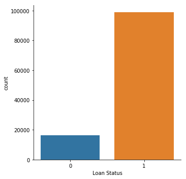


```python
train['Credit Score'].describe()
```


    count    115073.000000
    mean       1075.093358
    std        1452.963405
    min         585.000000
    25%         717.000000
    50%         734.000000
    75%         744.000000
    max        7510.000000
    Name: Credit Score, dtype: float64


```python
train[train['Credit Score']>850]['Credit Score'].value_counts()
```


    7380.0    127
    7410.0    126
    7400.0    121
    7330.0    120
    7370.0    118
    7290.0    114
    7270.0    114
    7360.0    113
    7300.0    113
    7320.0    112
    7210.0    109
    7280.0    109
    7350.0    108
    7420.0    105
    7430.0    105
    7310.0    105
    7200.0     98
    7160.0     98
    7390.0     97
    7260.0     97
    7240.0     97
    7340.0     96
    7130.0     89
    7230.0     88
    7220.0     86
    7120.0     86
    7250.0     82
    7460.0     82
    7110.0     79
    7010.0     77
             ... 
    5950.0      5
    6340.0      5
    6190.0      5
    6210.0      5
    6160.0      4
    6150.0      4
    6100.0      4
    6060.0      4
    6080.0      4
    6010.0      4
    6130.0      4
    6230.0      4
    6310.0      4
    6260.0      4
    5970.0      4
    5990.0      3
    6050.0      3
    5980.0      2
    5920.0      2
    5960.0      2
    6000.0      2
    6140.0      2
    5870.0      2
    5930.0      2
    6070.0      2
    5910.0      2
    6030.0      2
    6090.0      2
    6040.0      1
    5850.0      1
    Name: Credit Score, Length: 162, dtype: int64


```python
sns.catplot(data=train, x='Credit Score', kind='count')
```


    <seaborn.axisgrid.FacetGrid at 0x1a11b2f2b0>


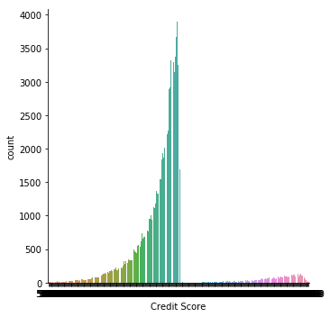


```python
train['Credit Score'] = train['Credit Score'].apply(lambda x: x/10 if x > 850 else x)
```


```python
train['Credit Score'].describe()
```


    count    115073.000000
    mean        723.646772
    std          26.336369
    min         585.000000
    25%         714.000000
    50%         732.000000
    75%         742.000000
    max         751.000000
    Name: Credit Score, dtype: float64


```python
sns.catplot(data=train, x='Credit Score', kind='count')
```


    <seaborn.axisgrid.FacetGrid at 0x1a10ff07b8>


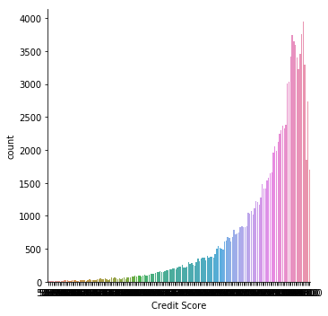


```python
define('Bankruptcies')
```

    The total number of bankruptcies.


```python
train.Bankruptcies.value_counts()
```


    0.0    102925
    1.0     11376
    2.0       438
    3.0        91
    4.0        12
    5.0         8
    6.0         1
    Name: Bankruptcies, dtype: int64


```python
train.pivot_table('Loan Status','Bankruptcies',aggfunc=lambda x: mode(x).mode[0])
```


<div>
<style scoped>
    .dataframe tbody tr th:only-of-type {
        vertical-align: middle;
    }

    .dataframe tbody tr th {
        vertical-align: top;
    }

    .dataframe thead th {
        text-align: right;
    }
</style>
<table border="1" class="dataframe">
  <thead>
    <tr style="text-align: right;">
      <th></th>
      <th>Loan Status</th>
    </tr>
    <tr>
      <th>Bankruptcies</th>
      <th></th>
    </tr>
  </thead>
  <tbody>
    <tr>
      <th>0.0</th>
      <td>1</td>
    </tr>
    <tr>
      <th>1.0</th>
      <td>1</td>
    </tr>
    <tr>
      <th>2.0</th>
      <td>1</td>
    </tr>
    <tr>
      <th>3.0</th>
      <td>1</td>
    </tr>
    <tr>
      <th>4.0</th>
      <td>1</td>
    </tr>
    <tr>
      <th>5.0</th>
      <td>1</td>
    </tr>
    <tr>
      <th>6.0</th>
      <td>1</td>
    </tr>
  </tbody>
</table>
</div>


```python
define('Number of Credit Problems')
```

    The number of credit problems in the customer records.


```python
train['Number of Credit Problems'].value_counts()
```


    0     99925
    1     13180
    2      1376
    3       363
    4       129
    5        58
    6        21
    8         8
    7         8
    9         3
    10        2
    Name: Number of Credit Problems, dtype: int64


```python
df = train.dropna()
```


```python
(df['Number of Credit Problems'] == df['Bankruptcies'] + df['Tax Liens']).value_counts()
```


    True     57319
    False     1420
    dtype: int64


```python
train[train['Maximum Open Credit'].str.isnumeric() == False]
```


<div>
<style scoped>
    .dataframe tbody tr th:only-of-type {
        vertical-align: middle;
    }

    .dataframe tbody tr th {
        vertical-align: top;
    }

    .dataframe thead th {
        text-align: right;
    }
</style>
<table border="1" class="dataframe">
  <thead>
    <tr style="text-align: right;">
      <th></th>
      <th>Loan ID</th>
      <th>Customer ID</th>
      <th>Loan Status</th>
      <th>Current Loan Amount</th>
      <th>Term</th>
      <th>Credit Score</th>
      <th>Years in current job</th>
      <th>Home Ownership</th>
      <th>Annual Income</th>
      <th>Purpose</th>
      <th>Monthly Debt</th>
      <th>Years of Credit History</th>
      <th>Months since last delinquent</th>
      <th>Number of Open Accounts</th>
      <th>Number of Credit Problems</th>
      <th>Current Credit Balance</th>
      <th>Maximum Open Credit</th>
      <th>Bankruptcies</th>
      <th>Tax Liens</th>
    </tr>
  </thead>
  <tbody>
    <tr>
      <th>184663</th>
      <td>b798f46b-e27b-4823-af83-294b1ffc3490</td>
      <td>f61890c5-e264-4b0f-a047-9cfa03b9d182</td>
      <td>0</td>
      <td>1470</td>
      <td>Short Term</td>
      <td>725.0</td>
      <td>2 years</td>
      <td>Rent</td>
      <td>39200.0</td>
      <td>Debt Consolidation</td>
      <td>$506.34</td>
      <td>15.3</td>
      <td>26.0</td>
      <td>3</td>
      <td>0</td>
      <td>0</td>
      <td>#VALUE!</td>
      <td>0.0</td>
      <td>0.0</td>
    </tr>
  </tbody>
</table>
</div>


```python
any(train['Maximum Open Credit'] == '#VALUE!')
```


    True


```python
dataset_objects = train.select_dtypes(['object'])
print(dataset_objects.columns,end='\n\n')

for col in dataset_objects:
    if any(train[col] == '#VALUE!'):
        print(col)
```

    Index(['Loan ID', 'Customer ID', 'Term', 'Years in current job',
           'Home Ownership', 'Purpose', 'Monthly Debt', 'Maximum Open Credit'],
          dtype='object')
    
    Maximum Open Credit


```python
train['Maximum Open Credit'] = train['Maximum Open Credit'].map(lambda x: np.nan if x == '#VALUE!' else x).astype(float)
```


```python
train['Term'].value_counts()
```


    Short Term    89599
    Long Term     25474
    Name: Term, dtype: int64


```python
train['Term'] = le.fit_transform(train['Term'])
```


```python
train['Term'].value_counts().index.values
```


    array([1, 0])


```python
le.inverse_transform(train['Term'].value_counts().index.values)
```


    array(['Short Term', 'Long Term'], dtype=object)


```python
train['Home Ownership'].value_counts()
```


    Home Mortgage    57535
    Rent             47049
    Own Home         10226
    HaveMortgage       263
    Name: Home Ownership, dtype: int64


```python
define('Home Ownership')
```

    Categorical variable indicating home ownership. Values are "Rent", "Home Mortgage", and "Own". If the value is OWN, then the customer is a home owner with no mortgage


```python
train['Home Ownership'] = train['Home Ownership'].apply(lambda x: 'Home Mortgage' if x == 'HaveMortgage' else x)
```


```python
train['Home Ownership'].value_counts()
```


    Home Mortgage    57798
    Rent             47049
    Own Home         10226
    Name: Home Ownership, dtype: int64


```python
define('Monthly Debt')
```

    The customer's monthly payment for their existing loans


```python
train[train['Monthly Debt'].str.isnumeric() == False]['Monthly Debt'].head()
```


    0       $584.03
    1    $1,106.04 
    2    $1,321.85 
    3       $751.92
    4       $355.18
    Name: Monthly Debt, dtype: object


```python
train['Monthly Debt'] = train['Monthly Debt'].apply(lambda x: re.sub('[\$,]', '', x)).astype(float)
```


```python
train['Monthly Debt'].head()
```


    0     584.03
    1    1106.04
    2    1321.85
    3     751.92
    4     355.18
    Name: Monthly Debt, dtype: float64


```python
sns.distplot(train['Monthly Debt'])
```


    <matplotlib.axes._subplots.AxesSubplot at 0x1a11b82438>


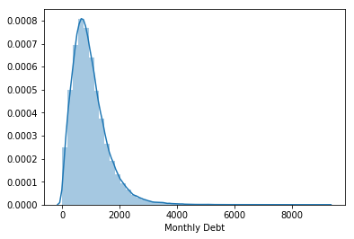


```python
sns.boxplot(x="Monthly Debt", data=train)
```


    <matplotlib.axes._subplots.AxesSubplot at 0x1a0db2cc50>


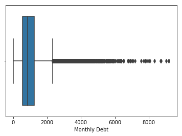


```python
sns.catplot(x="Term", y="Monthly Debt", hue="Loan Status", data=train, kind="bar")
```


    <seaborn.axisgrid.FacetGrid at 0x1a106026d8>


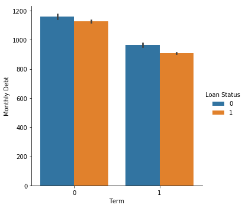


```python
train['Purpose'].value_counts()
```


    Debt Consolidation      91101
    Home Improvements        7078
    other                    6246
    Other                    4437
    Business Loan            1887
    Buy a Car                1595
    Medical Bills            1253
    Take a Trip               706
    Buy House                 676
    Educational Expenses       94
    Name: Purpose, dtype: int64


```python
train['Purpose'] = train['Purpose'].apply(lambda x: 'Other' if x == 'other' else x)
```


```python
#Purpose and Home Ownership dummies
```


```python
train['Years in current job'].value_counts()
```


    10+ years    36275
    2 years      10757
    3 years       9428
    < 1 year      9415
    5 years       8022
    1 year        7581
    4 years       7180
    6 years       6492
    7 years       6224
    8 years       5512
    9 years       4428
    Name: Years in current job, dtype: int64


```python
train['Years in current job'] = train['Years in current job'].apply(lambda x: x if type(x) != type('foo') else x[:2].strip())
```


```python
train['Years in current job'] = train['Years in current job'].apply(lambda x: 0 if x == '<' else x).astype(float)
```


```python
sns.catplot(x='Years in current job',y='Loan Status',data=train, kind = 'bar')
```


    <seaborn.axisgrid.FacetGrid at 0x1a106449e8>


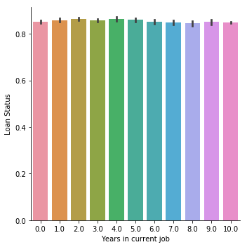


```python
train['Years in current job'].value_counts()
```


    10.0    36275
    2.0     10757
    3.0      9428
    0.0      9415
    5.0      8022
    1.0      7581
    4.0      7180
    6.0      6492
    7.0      6224
    8.0      5512
    9.0      4428
    Name: Years in current job, dtype: int64


```python
with pd.option_context('float_format', '{:f}'.format): 
    print(train.describe())
```

            Loan Status  Current Loan Amount          Term  Credit Score  \
    count 115073.000000        115073.000000 115073.000000 115073.000000   
    mean       0.858342         13769.544593      0.778627    723.646772   
    std        0.348700          8210.703609      0.415173     26.336369   
    min        0.000000           505.000000      0.000000    585.000000   
    25%        1.000000          7562.000000      1.000000    714.000000   
    50%        1.000000         11945.000000      1.000000    732.000000   
    75%        1.000000         18926.000000      1.000000    742.000000   
    max        1.000000         39304.000000      1.000000    751.000000   
    
           Years in current job  Annual Income  Monthly Debt  \
    count         111314.000000  115073.000000 115073.000000   
    mean               5.888091   74178.325228    964.170053   
    std                3.633143   52985.827108    631.621622   
    min                0.000000    4699.000000      0.000000   
    25%                3.000000   45652.000000    531.320000   
    50%                6.000000   63806.000000    845.180000   
    75%               10.000000   89298.000000   1254.510000   
    max               10.000000 7523240.000000   9190.170000   
    
           Years of Credit History  Months since last delinquent  \
    count            115073.000000                  60594.000000   
    mean                 18.454569                     35.014671   
    std                   6.972672                     21.870626   
    min                   3.700000                      0.000000   
    25%                  13.800000                     16.000000   
    50%                  17.100000                     32.000000   
    75%                  21.900000                     51.000000   
    max                  70.500000                    176.000000   
    
           Number of Open Accounts  Number of Credit Problems  \
    count            115073.000000              115073.000000   
    mean                 11.118281                   0.157465   
    std                   4.953655                   0.463440   
    min                   0.000000                   0.000000   
    25%                   8.000000                   0.000000   
    50%                  10.000000                   0.000000   
    75%                  14.000000                   0.000000   
    max                  55.000000                  10.000000   
    
           Current Credit Balance  Maximum Open Credit  Bankruptcies     Tax Liens  
    count           115073.000000        115072.000000 114851.000000 115061.000000  
    mean             15190.394393         36325.075518      0.109873      0.027968  
    std              18688.068509        425067.683191      0.336290      0.249526  
    min                  0.000000             0.000000      0.000000      0.000000  
    25%               5800.000000         12855.750000      0.000000      0.000000  
    50%              10853.000000         21893.000000      0.000000      0.000000  
    75%              18991.000000         36564.000000      0.000000      0.000000  
    max             818209.000000      96708247.000000      6.000000     10.000000  


```python
#sns.boxplot(x="Annual Income", data=train)
```


```python
Q1 = train['Annual Income'].quantile(0.25)
Q3 = train['Annual Income'].quantile(0.75)

IQR = Q3 - Q1

lower_limit = Q1 - 1.5 * IQR
upper_limit = Q3 + 1.5 * IQR

print(lower_limit,upper_limit)
```

    -19817.0 154767.0


```python
criteria0 = train['Annual Income'] < lower_limit
criteria1 = train['Annual Income'] > upper_limit
```


```python
#train.drop(train[criteria0 | criteria1].index,inplace=True)
```


```python
sns.boxplot(x="Annual Income", data=train)
```


    <matplotlib.axes._subplots.AxesSubplot at 0x1a108be6a0>


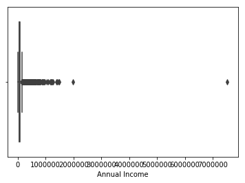


```python
sns.distplot(train['Annual Income'])
```


    <matplotlib.axes._subplots.AxesSubplot at 0x1a109049e8>


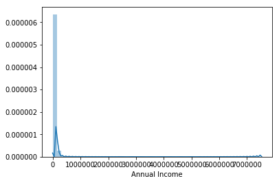


```python
train = pd.get_dummies(train,columns=['Home Ownership','Purpose'],drop_first=True)
```


```python
train.info()
```

    <class 'pandas.core.frame.DataFrame'>
    Int64Index: 115073 entries, 0 to 256983
    Data columns (total 27 columns):
    Loan ID                         115073 non-null object
    Customer ID                     115073 non-null object
    Loan Status                     115073 non-null int64
    Current Loan Amount             115073 non-null int64
    Term                            115073 non-null int64
    Credit Score                    115073 non-null float64
    Years in current job            111314 non-null float64
    Annual Income                   115073 non-null float64
    Monthly Debt                    115073 non-null float64
    Years of Credit History         115073 non-null float64
    Months since last delinquent    60594 non-null float64
    Number of Open Accounts         115073 non-null int64
    Number of Credit Problems       115073 non-null int64
    Current Credit Balance          115073 non-null int64
    Maximum Open Credit             115072 non-null float64
    Bankruptcies                    114851 non-null float64
    Tax Liens                       115061 non-null float64
    Home Ownership_Own Home         115073 non-null uint8
    Home Ownership_Rent             115073 non-null uint8
    Purpose_Buy House               115073 non-null uint8
    Purpose_Buy a Car               115073 non-null uint8
    Purpose_Debt Consolidation      115073 non-null uint8
    Purpose_Educational Expenses    115073 non-null uint8
    Purpose_Home Improvements       115073 non-null uint8
    Purpose_Medical Bills           115073 non-null uint8
    Purpose_Other                   115073 non-null uint8
    Purpose_Take a Trip             115073 non-null uint8
    dtypes: float64(9), int64(6), object(2), uint8(10)
    memory usage: 21.9+ MB


```python
missing_values = train.isnull().sum()
missing_values = missing_values[missing_values > 0].sort_values(ascending=True)
missing_values
```


    Maximum Open Credit                 1
    Tax Liens                          12
    Bankruptcies                      222
    Years in current job             3759
    Months since last delinquent    54479
    dtype: int64


```python
train.dropna(subset=['Maximum Open Credit','Tax Liens','Bankruptcies','Years in current job'],inplace=True)
```


```python
train.corr()['Loan Status'].sort_values(ascending=False)
```


    Loan Status                     1.000000
    Credit Score                    0.250238
    Term                            0.150068
    Current Credit Balance          0.033875
    Annual Income                   0.029791
    Purpose_Buy a Car               0.023394
    Months since last delinquent    0.019771
    Maximum Open Credit             0.008227
    Purpose_Educational Expenses    0.005538
    Purpose_Home Improvements       0.003241
    Purpose_Debt Consolidation      0.002213
    Purpose_Take a Trip             0.001801
    Purpose_Buy House               0.001708
    Bankruptcies                    0.001678
    Purpose_Other                   0.000060
    Purpose_Medical Bills          -0.004940
    Home Ownership_Own Home        -0.008086
    Years in current job           -0.010652
    Home Ownership_Rent            -0.022351
    Years of Credit History        -0.022552
    Number of Credit Problems      -0.023289
    Tax Liens                      -0.026371
    Monthly Debt                   -0.041890
    Number of Open Accounts        -0.050758
    Current Loan Amount            -0.065002
    Name: Loan Status, dtype: float64


```python
train[pd.isnull(train['Months since last delinquent'])==False]['Loan Status'].value_counts()
```


    1    42573
    0    16165
    Name: Loan Status, dtype: int64


```python
train[pd.isnull(train['Months since last delinquent'])==True]['Loan Status'].value_counts()
```


    1    52237
    0      116
    Name: Loan Status, dtype: int64


```python
42573/(42573+16165)
```


    0.7247948517143927


```python
52237/(116+52237)
```


    0.9977842721525032


```python
from sklearn.linear_model import LinearRegression
linreg = LinearRegression()
```


```python
test_delinquent = train[train['Months since last delinquent'].isnull()].drop(['Loan ID','Customer ID','Months since last delinquent'],axis=1)
```


```python
train_delinquent = train.select_dtypes(['number']).dropna()
```


```python
X = train_delinquent.drop(['Months since last delinquent'],axis=1)
```


```python
y = train_delinquent['Months since last delinquent']
```


```python
linreg.fit(X,y)
```


    LinearRegression(copy_X=True, fit_intercept=True, n_jobs=None,
             normalize=False)


```python
test_delinquent['Months since last delinquent'] = linreg.predict(test_delinquent)
```


```python
#train['Months since last delinquent'].fillna(test_delinquent['Months since last delinquent'],inplace=True)
```


```python
train['Months since last delinquent'].dropna(inplace=True)
```


```python
test_delinquent['Months since last delinquent'].describe()
```


    count    52353.000000
    mean        36.158828
    std          3.003641
    min          9.595224
    25%         34.414672
    50%         35.856736
    75%         37.475998
    max         66.719469
    Name: Months since last delinquent, dtype: float64


```python
train.info()
```

    <class 'pandas.core.frame.DataFrame'>
    Int64Index: 111091 entries, 0 to 256983
    Data columns (total 27 columns):
    Loan ID                         111091 non-null object
    Customer ID                     111091 non-null object
    Loan Status                     111091 non-null int64
    Current Loan Amount             111091 non-null int64
    Term                            111091 non-null int64
    Credit Score                    111091 non-null float64
    Years in current job            111091 non-null float64
    Annual Income                   111091 non-null float64
    Monthly Debt                    111091 non-null float64
    Years of Credit History         111091 non-null float64
    Months since last delinquent    58738 non-null float64
    Number of Open Accounts         111091 non-null int64
    Number of Credit Problems       111091 non-null int64
    Current Credit Balance          111091 non-null int64
    Maximum Open Credit             111091 non-null float64
    Bankruptcies                    111091 non-null float64
    Tax Liens                       111091 non-null float64
    Home Ownership_Own Home         111091 non-null uint8
    Home Ownership_Rent             111091 non-null uint8
    Purpose_Buy House               111091 non-null uint8
    Purpose_Buy a Car               111091 non-null uint8
    Purpose_Debt Consolidation      111091 non-null uint8
    Purpose_Educational Expenses    111091 non-null uint8
    Purpose_Home Improvements       111091 non-null uint8
    Purpose_Medical Bills           111091 non-null uint8
    Purpose_Other                   111091 non-null uint8
    Purpose_Take a Trip             111091 non-null uint8
    dtypes: float64(9), int64(6), object(2), uint8(10)
    memory usage: 15.9+ MB


```python
sns.distplot(train['Months since last delinquent'])
```


    <matplotlib.axes._subplots.AxesSubplot at 0x1a106e6630>


```python
train.to_csv('train_cleaned.csv',index=False)
```
