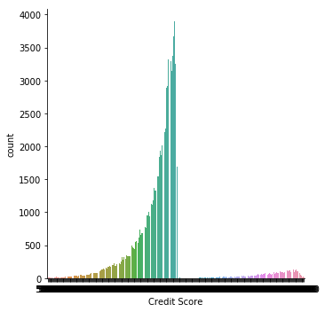
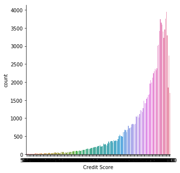
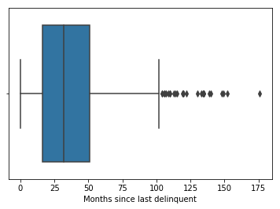
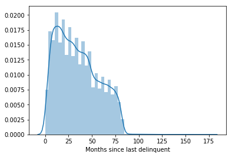
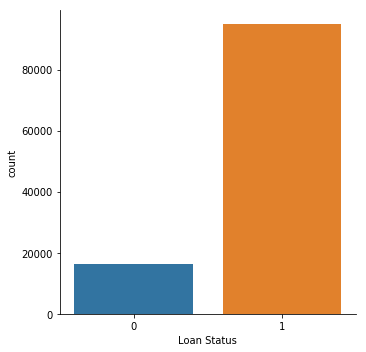

# Business Objective: 
A financial institution wants help identifying customers who have a lesser chance of defaulting on their loan.

Build a predictive model that would predict who would be a good customer and come up with questions to ask <br>
the client when they are applying for loan based on the model.
***

## Cleaning Required
- Remove duplicates
- Incorrect data entry in credit score
- Change 'Monthly Debt' from currency format to float
- Remove '#VALUE!' from 'Maximum Open Credit'
- Fix spelling difference in 'Purpose' and 'Home Ownership'
- Drop 'Current Loan Amount' where value equals 99999999
- Null values
- Categorical variables


```python
import pandas as pd
import numpy as np
import re

from statistics import mean 
from scipy.stats.mstats import mode

import seaborn as sns
from matplotlib import pyplot as plt

from sklearn.preprocessing import LabelEncoder
```


```python
train = pd.read_csv('train.csv',low_memory=False)
```


```python
definitions = {'Loan ID': 'A unique Identifier for the loan information.',
               'Customer ID': 'A unique identifier for the customer. Customers may have more than one loan.',
               'Loan Status': 'A categorical variable indicating if the loan was paid back or defaulted.',
               'Current Loan Amount': 'This is the loan amount that was either completely paid off, or the amount that was defaulted.',
               'Term': 'A categorical variable indicating if it is a short term or long term loan.',
               'Credit Score': 'A value between 0 and 850 indicating the riskiness of the borrowers credit history.',
               'Years in current job': 'A categorical variable indicating how many years the customer has been in their current job.',
               'Home Ownership': 'Categorical variable indicating home ownership. Values are "Rent", "Home Mortgage", and "Own". If the value is OWN, then the customer is a home owner with no mortgage',
               'Annual Income': "The customer's annual income",
               'Purpose': 'A description of the purpose of the loan.',
               'Monthly Debt': "The customer's monthly payment for their existing loans",
               'Years of Credit History': "The years since the first entry in the customer’s credit history",
               'Months since last delinquent': 'Months since the last loan delinquent payment',
               'Number of Open Accounts': 'The total number of open credit cards',
               'Number of Credit Problems': 'The number of credit problems in the customer records.',
               'Current Credit Balance': 'The current total debt for the customer',
               'Maximum Open Credit': 'The maximum credit limit for all credit sources.',
               'Bankruptcies': 'The total number of bankruptcies.',
               'Tax Liens': 'The number of tax liens.'}
```


```python
def define(column_name):
    """Returns definition of column name if name is in definitions"""
    try:
        print(definitions[column_name])
    except KeyError:
        print("'" + column_name + "'",'not found in definitions.')
```

**Verifiying which ID can have duplicates.**


```python
define('Loan ID') #should have no duplicates
```

    A unique Identifier for the loan information.


```python
define('Customer ID') #can have duplicates
```

    A unique identifier for the customer. Customers may have more than one loan.


```python
train.duplicated('Loan ID').value_counts()
```


    False    215700
    True      41284
    dtype: int64


**Preparing to specifically drop the duplicate row with null values before dropping the remaining duplicates.**


```python
duplics = train[train.duplicated('Loan ID',False)].isnull().any(axis=1)
```


```python
train.drop(duplics[duplics == True].index,inplace = True)
```


```python
train.duplicated('Loan ID').value_counts()
```


    False    192570
    True      10405
    dtype: int64


```python
train.drop_duplicates('Loan ID',inplace=True)
```


```python
train.duplicated('Loan ID').value_counts()
```


    False    192570
    dtype: int64


**'Credit Score' and 'Annual Income' have the same number of rows with missing information. The missing information appears in the same rows given dropping null values in one column removes the null values of the other.**


```python
missing_values0 = train.isnull().sum()
missing_values0 = missing_values0[missing_values0 > 0].sort_values(ascending=True)
missing_values0
```


    Tax Liens                          21
    Bankruptcies                      379
    Years in current job             6668
    Credit Score                    42287
    Annual Income                   42287
    Months since last delinquent    97245
    dtype: int64


```python
train[pd.isnull(train['Annual Income'])]['Loan Status'].value_counts()
```


    Fully Paid     42209
    Charged Off       78
    Name: Loan Status, dtype: int64


**Dropping these rows removes approximately 22 percent of the dataset. Imputing such a large percentage of the data would likely negatively impact the effect credit score and annual income play in predicting loan status.**


```python
train.dropna(axis=0,subset=['Annual Income'],inplace=True)
```


```python
round(42209/192570*100,2)
```


    21.92


```python
missing_values1 = train.isnull().sum()
missing_values1[missing_values0.index.values]
```


    Tax Liens                          14
    Bankruptcies                      293
    Years in current job             5134
    Credit Score                        0
    Annual Income                       0
    Months since last delinquent    73984
    dtype: int64


**This dataset has records with a 'Current Loan Amount' of 99999999, interpreting it as missing values considering the max without these records is 39,304.**


```python
train['Current Loan Amount'].describe()
```


    count    1.502830e+05
    mean     2.343967e+07
    std      4.234981e+07
    min      5.050000e+02
    25%      9.028000e+03
    50%      1.532900e+04
    75%      3.481550e+04
    max      1.000000e+08
    Name: Current Loan Amount, dtype: float64


```python
train[train['Current Loan Amount']>=39304]['Current Loan Amount'].value_counts()
```


    99999999    35210
    39304           1
    Name: Current Loan Amount, dtype: int64


```python
train = train[train['Current Loan Amount']!=99999999]
```


```python
train['Current Loan Amount'].describe()
```


    count    115073.000000
    mean      13769.544593
    std        8210.703609
    min         505.000000
    25%        7562.000000
    50%       11945.000000
    75%       18926.000000
    max       39304.000000
    Name: Current Loan Amount, dtype: float64


**According to the data dictionary above 850 or below zero is an incorrect value.**


```python
define('Credit Score')
```

    A value between 0 and 850 indicating the riskiness of the borrowers credit history.


```python
train['Credit Score'].describe()
```


    count    115073.000000
    mean       1075.093358
    std        1452.963405
    min         585.000000
    25%         717.000000
    50%         734.000000
    75%         744.000000
    max        7510.000000
    Name: Credit Score, dtype: float64


**The values above 850 represent credit scores with an extra zero at the end.**


```python
train[train['Credit Score']>850]['Credit Score'].value_counts()
```


    7380.0    127
    7410.0    126
    7400.0    121
    7330.0    120
    7370.0    118
    7290.0    114
    7270.0    114
    7360.0    113
    7300.0    113
    7320.0    112
    7210.0    109
    7280.0    109
    7350.0    108
    7420.0    105
    7430.0    105
    7310.0    105
    7200.0     98
    7160.0     98
    7390.0     97
    7260.0     97
    7240.0     97
    7340.0     96
    7130.0     89
    7230.0     88
    7220.0     86
    7120.0     86
    7250.0     82
    7460.0     82
    7110.0     79
    7010.0     77
             ... 
    5950.0      5
    6340.0      5
    6190.0      5
    6210.0      5
    6160.0      4
    6150.0      4
    6100.0      4
    6060.0      4
    6080.0      4
    6010.0      4
    6130.0      4
    6230.0      4
    6310.0      4
    6260.0      4
    5970.0      4
    5990.0      3
    6050.0      3
    5980.0      2
    5920.0      2
    5960.0      2
    6000.0      2
    6140.0      2
    5870.0      2
    5930.0      2
    6070.0      2
    5910.0      2
    6030.0      2
    6090.0      2
    6040.0      1
    5850.0      1
    Name: Credit Score, Length: 162, dtype: int64


```python
sns.catplot(data=train, x='Credit Score', kind='count')
```


    <seaborn.axisgrid.FacetGrid at 0x1a1c0ccc88>





**Removing the extra zero from values above 850 brings all credit score values between the range of 0 to 850**


```python
train['Credit Score'] = train['Credit Score'].apply(lambda x: x/10 if x > 850 else x)
```


```python
train['Credit Score'].describe()
```


    count    115073.000000
    mean        723.646772
    std          26.336369
    min         585.000000
    25%         714.000000
    50%         732.000000
    75%         742.000000
    max         751.000000
    Name: Credit Score, dtype: float64


```python
sns.catplot(data=train, x='Credit Score', kind='count')
```


    <seaborn.axisgrid.FacetGrid at 0x1a1c08b048>





**Searching for '#VALUE!' and setting equal to nan**


```python
train[train['Maximum Open Credit'].str.isnumeric() == False]['Maximum Open Credit']
```


    184663    #VALUE!
    Name: Maximum Open Credit, dtype: object


```python
dataset_objects = train.select_dtypes(['object'])
print(dataset_objects.columns,end='\n\n')

for col in dataset_objects:
    if any(train[col] == '#VALUE!'):
        print(col)
```

    Index(['Loan ID', 'Customer ID', 'Loan Status', 'Term', 'Years in current job',
           'Home Ownership', 'Purpose', 'Monthly Debt', 'Maximum Open Credit'],
          dtype='object')
    
    Maximum Open Credit


```python
train['Maximum Open Credit'] = train['Maximum Open Credit'].map(lambda x: np.nan if x == '#VALUE!' else x).astype(float)
```

**Fixing typo in 'Home Ownership' column**


```python
train['Home Ownership'].value_counts()
```


    Home Mortgage    57535
    Rent             47049
    Own Home         10226
    HaveMortgage       263
    Name: Home Ownership, dtype: int64


```python
define('Home Ownership')
```

    Categorical variable indicating home ownership. Values are "Rent", "Home Mortgage", and "Own". If the value is OWN, then the customer is a home owner with no mortgage


```python
train['Home Ownership'] = train['Home Ownership'].apply(lambda x: 'Home Mortgage' if x == 'HaveMortgage' else x)
```


```python
train['Home Ownership'].value_counts()
```


    Home Mortgage    57798
    Rent             47049
    Own Home         10226
    Name: Home Ownership, dtype: int64


**Removing currency symbols in 'Monthly Debt' column**


```python
train[train['Monthly Debt'].str.isnumeric() == False]['Monthly Debt'].head()
```


    0       $584.03
    1    $1,106.04 
    2    $1,321.85 
    3       $751.92
    4       $355.18
    Name: Monthly Debt, dtype: object


```python
train['Monthly Debt'] = train['Monthly Debt'].apply(lambda x: re.sub('[\$,]', '', x)).astype(float)
```


```python
train['Monthly Debt'].head()
```


    0     584.03
    1    1106.04
    2    1321.85
    3     751.92
    4     355.18
    Name: Monthly Debt, dtype: float64


**Fixing differnt spelling in 'Purpose' column**


```python
train['Purpose'].value_counts()
```


    Debt Consolidation      91101
    Home Improvements        7078
    other                    6246
    Other                    4437
    Business Loan            1887
    Buy a Car                1595
    Medical Bills            1253
    Take a Trip               706
    Buy House                 676
    Educational Expenses       94
    Name: Purpose, dtype: int64


```python
train['Purpose'] = train['Purpose'].apply(lambda x: 'Other' if x == 'other' else x)
```

**Converting 'Years in current job' to numerical values**


```python
train['Years in current job'].value_counts()
```


    10+ years    36275
    2 years      10757
    3 years       9428
    < 1 year      9415
    5 years       8022
    1 year        7581
    4 years       7180
    6 years       6492
    7 years       6224
    8 years       5512
    9 years       4428
    Name: Years in current job, dtype: int64


```python
train['Years in current job'] = train['Years in current job'].apply(lambda x: x if type(x) != type('foo') else x[:2].strip())
```


```python
train['Years in current job'] = train['Years in current job'].apply(lambda x: 0 if x == '<' else x).astype(float)
```


```python
train['Years in current job'].value_counts()
```


    10.0    36275
    2.0     10757
    3.0      9428
    0.0      9415
    5.0      8022
    1.0      7581
    4.0      7180
    6.0      6492
    7.0      6224
    8.0      5512
    9.0      4428
    Name: Years in current job, dtype: int64


```python
train = pd.get_dummies(train,columns=['Home Ownership','Purpose'],drop_first=True)
```


```python
missing_values = train.isnull().sum()
missing_values = missing_values[missing_values > 0].sort_values(ascending=True)
missing_values
```


    Maximum Open Credit                 1
    Tax Liens                          12
    Bankruptcies                      222
    Years in current job             3759
    Months since last delinquent    54479
    dtype: int64


**Encoding 'Loan Status' and 'Term'**


```python
le = LabelEncoder()
train['Loan Status'] = le.fit_transform(train['Loan Status'])
```


```python
train['Loan Status'].value_counts().index.values
```


    array([1, 0])


```python
le.inverse_transform(train['Loan Status'].value_counts().index.values)
```


    array(['Fully Paid', 'Charged Off'], dtype=object)


```python
train['Term'] = le.fit_transform(train['Term'])
```


```python
train['Term'].value_counts().index.values
```


    array([1, 0])


```python
le.inverse_transform(train['Term'].value_counts().index.values)
```


    array(['Short Term', 'Long Term'], dtype=object)


**Considering the mode of 'Years in current job' does not change as the # of tax liens increases/decreases dropping the null values is reasonable**


```python
train.pivot_table(values='Loan Status',index='Years in current job', aggfunc=lambda x: mode(x).mode[0])
```


<div>
<style scoped>
    .dataframe tbody tr th:only-of-type {
        vertical-align: middle;
    }

    .dataframe tbody tr th {
        vertical-align: top;
    }

    .dataframe thead th {
        text-align: right;
    }
</style>
<table border="1" class="dataframe">
  <thead>
    <tr style="text-align: right;">
      <th></th>
      <th>Loan Status</th>
    </tr>
    <tr>
      <th>Years in current job</th>
      <th></th>
    </tr>
  </thead>
  <tbody>
    <tr>
      <th>0.0</th>
      <td>1</td>
    </tr>
    <tr>
      <th>1.0</th>
      <td>1</td>
    </tr>
    <tr>
      <th>2.0</th>
      <td>1</td>
    </tr>
    <tr>
      <th>3.0</th>
      <td>1</td>
    </tr>
    <tr>
      <th>4.0</th>
      <td>1</td>
    </tr>
    <tr>
      <th>5.0</th>
      <td>1</td>
    </tr>
    <tr>
      <th>6.0</th>
      <td>1</td>
    </tr>
    <tr>
      <th>7.0</th>
      <td>1</td>
    </tr>
    <tr>
      <th>8.0</th>
      <td>1</td>
    </tr>
    <tr>
      <th>9.0</th>
      <td>1</td>
    </tr>
    <tr>
      <th>10.0</th>
      <td>1</td>
    </tr>
  </tbody>
</table>
</div>


**Considering the mode of loan status does not change as the # of tax liens increases/decreases dropping the null values is reasonable**


```python
train['Tax Liens'].value_counts()
```


    0.0     112945
    1.0       1477
    2.0        409
    3.0        113
    4.0         57
    5.0         31
    6.0         16
    7.0          5
    9.0          4
    8.0          3
    10.0         1
    Name: Tax Liens, dtype: int64


```python
train.pivot_table(values='Loan Status',index='Tax Liens', aggfunc=lambda x: mode(x).mode[0])
```


<div>
<style scoped>
    .dataframe tbody tr th:only-of-type {
        vertical-align: middle;
    }

    .dataframe tbody tr th {
        vertical-align: top;
    }

    .dataframe thead th {
        text-align: right;
    }
</style>
<table border="1" class="dataframe">
  <thead>
    <tr style="text-align: right;">
      <th></th>
      <th>Loan Status</th>
    </tr>
    <tr>
      <th>Tax Liens</th>
      <th></th>
    </tr>
  </thead>
  <tbody>
    <tr>
      <th>0.0</th>
      <td>1</td>
    </tr>
    <tr>
      <th>1.0</th>
      <td>1</td>
    </tr>
    <tr>
      <th>2.0</th>
      <td>1</td>
    </tr>
    <tr>
      <th>3.0</th>
      <td>1</td>
    </tr>
    <tr>
      <th>4.0</th>
      <td>1</td>
    </tr>
    <tr>
      <th>5.0</th>
      <td>1</td>
    </tr>
    <tr>
      <th>6.0</th>
      <td>1</td>
    </tr>
    <tr>
      <th>7.0</th>
      <td>1</td>
    </tr>
    <tr>
      <th>8.0</th>
      <td>1</td>
    </tr>
    <tr>
      <th>9.0</th>
      <td>0</td>
    </tr>
    <tr>
      <th>10.0</th>
      <td>1</td>
    </tr>
  </tbody>
</table>
</div>


**Considering the mode of loan status does not change as the # of bankruptcies increases/decreases dropping the null values is reasonable**


```python
train[pd.isnull(train['Bankruptcies'])]['Loan Status'].value_counts()
```


    1    222
    Name: Loan Status, dtype: int64


```python
train.Bankruptcies.value_counts()
```


    0.0    102925
    1.0     11376
    2.0       438
    3.0        91
    4.0        12
    5.0         8
    6.0         1
    Name: Bankruptcies, dtype: int64


```python
train.pivot_table('Loan Status','Bankruptcies',aggfunc=lambda x: mode(x).mode[0])
```


<div>
<style scoped>
    .dataframe tbody tr th:only-of-type {
        vertical-align: middle;
    }

    .dataframe tbody tr th {
        vertical-align: top;
    }

    .dataframe thead th {
        text-align: right;
    }
</style>
<table border="1" class="dataframe">
  <thead>
    <tr style="text-align: right;">
      <th></th>
      <th>Loan Status</th>
    </tr>
    <tr>
      <th>Bankruptcies</th>
      <th></th>
    </tr>
  </thead>
  <tbody>
    <tr>
      <th>0.0</th>
      <td>1</td>
    </tr>
    <tr>
      <th>1.0</th>
      <td>1</td>
    </tr>
    <tr>
      <th>2.0</th>
      <td>1</td>
    </tr>
    <tr>
      <th>3.0</th>
      <td>1</td>
    </tr>
    <tr>
      <th>4.0</th>
      <td>1</td>
    </tr>
    <tr>
      <th>5.0</th>
      <td>1</td>
    </tr>
    <tr>
      <th>6.0</th>
      <td>1</td>
    </tr>
  </tbody>
</table>
</div>


**Data dictionary does not provide enough information whether null values in 'Months since last delinquent' should be classified as loans without delinquencies or as missing values. Most of the missing values have a loan status of 1 (Fully Paid) so it might be reasonable to create a new feature indicating deliquency/no deliquency.**


```python
train[pd.isnull(train['Months since last delinquent'])==False]['Loan Status'].value_counts()
```


    1    44417
    0    16177
    Name: Loan Status, dtype: int64


```python
train[pd.isnull(train['Months since last delinquent'])==True]['Loan Status'].value_counts()
```


    1    54355
    0      124
    Name: Loan Status, dtype: int64


```python
42573/(42573+16165)
```


    0.7247948517143927


```python
52237/(116+52237)
```


    0.9977842721525032


**Dropping null values**


```python
train = train.dropna(subset=['Maximum Open Credit','Tax Liens','Bankruptcies','Years in current job'])
```

Most of the data from 'Months since last delinquent' is between 0 and 51


```python
print(train['Months since last delinquent'].describe(),end="\n\n")
print(len(train[train['Months since last delinquent'] > 51]),'records above 75 percentile.')
sns.boxplot('Months since last delinquent', data = train)
```

    count    58738.000000
    mean        35.001737
    std         21.831647
    min          0.000000
    25%         16.000000
    50%         32.000000
    75%         51.000000
    max        176.000000
    Name: Months since last delinquent, dtype: float64
    
    14419 records above 75 percentile.


    <matplotlib.axes._subplots.AxesSubplot at 0x1a1b3f3e48>





```python
sns.distplot(train['Months since last delinquent'].dropna())
```


    <matplotlib.axes._subplots.AxesSubplot at 0x1a1b3f5c50>





```python
print(train['Loan Status'].value_counts() / train['Loan Status'].count(),end='\n\n')
print(train['Loan Status'].value_counts(),end='\n\n')
print('Number of records:', len(train))
```

    1    0.853444
    0    0.146556
    Name: Loan Status, dtype: float64
    
    1    94810
    0    16281
    Name: Loan Status, dtype: int64
    
    Number of records: 111091


```python
sns.catplot(data=train, x='Loan Status', kind='count')
```


    <seaborn.axisgrid.FacetGrid at 0x1a1af99ba8>





**There appears to a minimal amount of variation in loan status outcome with a change in years in current job**


```python
sns.catplot(x='Years in current job',y='Loan Status',data=train, kind = 'bar')
```


    <seaborn.axisgrid.FacetGrid at 0x1a1b3d6470>


**Credit Score, Term, Current Loan Amount, and Number of Open Accounts are most correlated to loan status without any feature engineering**


```python
train.corr()['Loan Status'].sort_values(ascending=False)
```


    Loan Status                     1.000000
    Credit Score                    0.250238
    Term                            0.150068
    Current Credit Balance          0.033875
    Annual Income                   0.029791
    Purpose_Buy a Car               0.023394
    Months since last delinquent    0.019771
    Maximum Open Credit             0.008227
    Purpose_Educational Expenses    0.005538
    Purpose_Home Improvements       0.003241
    Purpose_Debt Consolidation      0.002213
    Purpose_Take a Trip             0.001801
    Purpose_Buy House               0.001708
    Bankruptcies                    0.001678
    Purpose_Other                   0.000060
    Purpose_Medical Bills          -0.004940
    Home Ownership_Own Home        -0.008086
    Years in current job           -0.010652
    Home Ownership_Rent            -0.022351
    Years of Credit History        -0.022552
    Number of Credit Problems      -0.023289
    Tax Liens                      -0.026371
    Monthly Debt                   -0.041890
    Number of Open Accounts        -0.050758
    Current Loan Amount            -0.065002
    Name: Loan Status, dtype: float64


**Outputting cleaned training dataset for feature engineering and modeling. NOTE: Missing values in 'Months since last delinquent' were not dropped to create a new feature from the missing values**


```python
train.to_csv('train_cleaned.csv',index=False)
```
